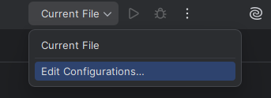
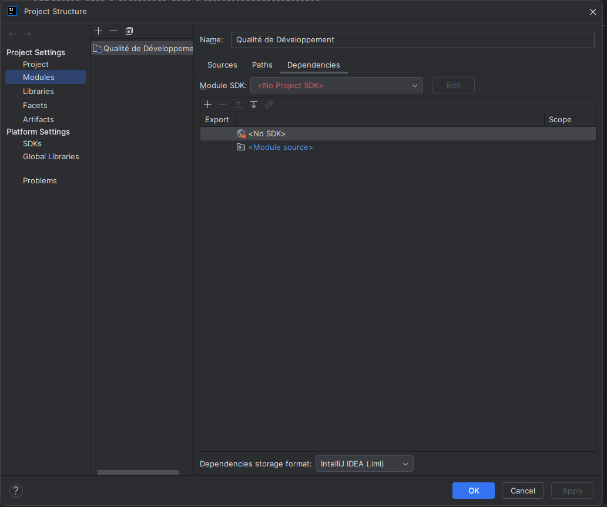

# Documentation

## Manuel d'installation de l'environnement

- Se créer un compte JetBrains
- Obtenir une licence JetBrains ou choisir d'utiliser l'essai gratuit de 30 jours. Certaines organisations peuvent détenir des licences avantageuses aux étudiants, penser à bien y prendre compte.
- Télécharger le logiciel IntellijIdea : <a href="https://www.jetbrains.com/idea/">page de téléchargement</a>
- Suivre le Setup Wizard du logiciel et faire la modification suivante : 

- Allumer le logiciel et l'initialiser selon ses préférences (retour sur les bugs, importation des paramètres d'un autre IDE)

## Manuel d'initialisation du projet
### Paramétrages JetBrains
- Créer le dossier qui devra contenir le code de l'application (Attention : Evitez que le dossier soit sur le Bureau à cause de potentiels risques d'erreurs de droit d'accès!)
- Faites un git clone de ce github
- <a href="https://account.jetbrains.com/login">Se connecter</a> à un compte JetBrains
- Vérifier si l'on possède une licence en cours.
- Relier votre compte à l'application IntellijIdea une fois l'<a href="https://www.jetbrains.com/idea/">installation du logiciel</a> terminée.
- Ouvrir le dossier contenant le code du projet dans l'application. 

### Paramétrages du projet
Après avoir ouvert votre dossier de travail et observé votre environnement, veuillez vérifier que les configurations Maven, JUnit et TomCat ont été initialisée par défaut comme dans l'image ci-dessous.

Si ce n'est pas le cas, vérifiez que seul la partie du git contenant le projet est allumée sur l'application. Sinon, suivez la procédure suivante :
<h4>Maven</h4>

- Cliquer sur l'onglet "Current file", puis sur "Edit configuration". 

- Cliquer sur le bouton "+" puis sélectionner la Run Configuration "Maven". 

- Ajouter dans la section "Run" la commande clean install -DskipTests puis cliquer sur OK. 

- Cliquer sur l'icône de la barre déroulante puis sur l'onglet "File", cliquer ensuite sur "Project Structure".

  -  La partie <<-DskipTests>> de la commande permet de build l'application sans éxecuter tous les tests au démarrage.

- Une fois sur le nouvel onglet choisir la catégorie "Modules". 
- Cliquer ensuite sur la section "Dependencies", puis dans la liste déroulante "Module SDK", choisir exactement la version 17 de Oracle OpenJDK puis cliquer sur Apply.

- Cliquer sur le bouton "Play" vert en haut à droite pour build l'application. 

<h4>JUnit</h4>

- Cliquer sur l'onglet "Current file", puis sur "Edit configuration". 

- Sélectionner la Run Configuration "JUnit" avec les informations suivantes. 

<h4>TomCat</h4>

- Cliquer sur l'onglet "Current file", puis sur "Edit configuration". 

- Sélectionner la Run Configuration "TomCat Server", puis "local" avec les informations suivantes. 

- Si Application Server est vide, allez sur <a href="tomcat.apache.org/download-90.cgi">ce site</a> pour télécharger Tomcat 9.0.80.

Attention, si vous êtes sous Linux à ne pas oublier de donner les droits adéquats à Tomcat. Voici la commande à rentrer si vous n'êtes pas habitué à Linux et à sa gestion des droits : `chmod --recursive +777 apache-tomcat-9.0.109/`.

Par la suite, retournez sur le dernier écran indiqué sur cette documentation. 

- Appuyez sur Configure... et ajoutez le chemin pour accéder à la configuration Tomcat que vous venez de télécharger.

- Dans Before Launch, supprimez le contenu existant via le bouton "-". Ensuite, via le bouton "+", ajoutez une nouvelle tâche "Build Artifacts".

- Sélectionnez les deux éléments et validez.

- Dans l'onglet Deployment, vérifiez la présence de l'artifact.

### Paramétrage MySQLWorkbench

- Installer <a href="https://dev.mysql.com/downloads/workbench/">MySQL Workbench</a>
- Créer une connexion

L'url des bases de données sont : `jdbc:mysql://devweb.iutmetz.univ-lorraine.fr:3306/e0088u_bank_iut` et `jdbc:mysql://devweb.iutmetz.univ-lorraine.fr:3306/e0088u_bank_iut_test`.

## Structure des fichiers de test

La suite de tests est organisée dans le dossier src/test/java/com/iut/banque/test/ et suit la découpe du code métier : dao (accès BDD), facade (façade métier), controller (controlleurs pour entités) et modele (entités métier). 
Chaque classe est associée à un fichier de test dédié.

| Dossier | Fichiers principaux | Fonction |
|---------|----------------------|----------|
| dao     | TestsDaoHibernate.java | Tests sur la persistance avec Hibernate |
| facade  | TestsBanqueManager.java | Tests sur la façade métier globale |
| controller | TestsHashMotDePasse.java | Tests du hashage et salage des mots de passe |
| modele  | TestsClient.java, TestsCompte.java, TestsCompteSansDecouvert.java, TestsCompteAvecDecouvert.java | Tests sur les entités du modèle |

### Détail des fichiers de test

**TestsDaoHibernate.java**

Rôle : Tester toutes les fonctionnalités principales exposées par la DAO Hibernate, qui fait le lien entre les objets métier et la base de données.

Principaux tests :
- Recherche de comptes : existence, non-existence, vérification du type, intégrité des informations.
- Création de comptes : compte avec ou sans découvert, gestion des identifiants déjà présents, détection des erreurs et exceptions.
- Suppression de comptes : contrôle que la suppression fonctionne avec tous les cas de figure et que le compte n’est plus accessible ensuite.
- Gestion des utilisateurs : recherche, création, suppression avec gestion des conflits et vérification des informations.
- Association utilisateurs/comptes : récupération des comptes liés à un client, gestion des cas sans comptes ou clients inexistants.
- Authentification : validation du login/mot de passe, gestion des entrées invalides (null, vides, incorrectes).
- Contrôle des erreurs métiers : toutes les exceptions attendues sont systématiquement testées pour la robustesse.

**TestsBanqueManager.java**

Rôle : Tester la façade métier globale, qui orchestre les appels aux DAOs et encapsule les règles métier transverses.

Principaux tests :
- Création et suppression de clients, gestionnaires.
- Contrôle de la suppression en fonction des règles métier (dernier gestionnaire, client avec comptes actifs/à solde non nul).
- Gestion des exceptions en cas de conflits ou d’opérations impossibles.
- Vérification que tous les cas d’erreur sont anticipés et remontent l’exception métier appropriée.

**TestsHashMotDePasse.java**

Rôle : Tester la classe de hashage des mots de passe, essentielle pour la sécurité de l’application et placée dans le dossier `controller`.

Principaux tests :
- Longueur du hash : vérifie que le hash généré fait bien 16 octets après décodage Base64.
- Longueur du sel : vérifie que le sel généré fait aussi 16 octets.
- Entrées invalides : s’assure qu’un mot de passe null ou vide déclenche une exception explicite (IllegalArgumentException).
- Unicité du sel et du hash : vérifie que deux hashages d’un même mot de passe génèrent des résultats et des sels différents (randomisation correcte).

**TestsClient.java**

Rôle : Assurer que la classe Client respecte les règles de format et de comportement attendues.

Principaux tests :
- Conformité du format d’identifiant utilisateur (UserId), vérification de la validité des formats acceptés/refusés.
- Format du numéro de client (longueur, numérisation, caractères non valides).
- Méthodes métier : possession de comptes à découvert, récupération des comptes avec solde non nul.
- Gestion des cas avec plusieurs comptes, aucun compte, formats erronés ou informations manquantes.

**TestsCompte.java**

Rôle : Tester les opérations et règles associées à la classe Compte.

Principaux tests :
- Crédit et débit des comptes, avec gestion correcte des soldes et exceptions en cas de montants négatifs.
- Format du numéro de compte (structure, longueur, caractères), vérification du refus des formats non conformes.
- Tests sur le constructeur et autres méthodes de gestion du compte.

**TestsCompteSansDecouvert.java**

Rôle : Tester les cas et limites spécifiques au Compte sans découvert.

Principaux tests :
- Vérification que le nom de la classe retourné est correct.
- Débit avec montant négatif et gestion d’exception IllegalFormatException.
- Débit d’un montant réalisable (solde supérieur) : solde mis à jour correctement.
- Débit d’un montant impossible (dépassement du seuil, fonds insuffisants) : levée de l’exception InsufficientFundsException, test du comportement attendu.

**TestsCompteAvecDecouvert.java**

Rôle : Tester les comportements propres aux comptes autorisant un découvert.

Principaux tests :
- Vérification du nom retourné par la classe.
- Débit avec montant négatif, vérification des exceptions de format.
- Débit d’un montant réalisable dans la limite du découvert autorisé : le solde passe dans le négatif, mais reste autorisé.
- Débit d’un montant dépassant la limite du découvert : exception de fonds insuffisants pour valider la sécurité métier.
