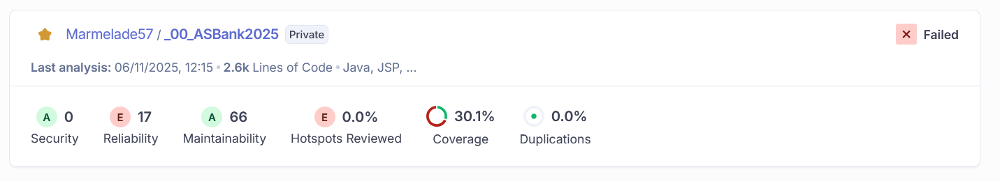

# SPRINT n°1
___
## Outil

Afin de bien mettre en place les indicateurs de tests on a choisit d'utiliser **SonarCloud.**
___
## Coverage
___
Avant le premier sprint le coverage n'était pas mis en place.

Le **coverage** était donc de 0.0%

___

Après ce sprint on a réussit à avoir mettre une version du coverage qui nous a affiché **30.1%**

___
## Tests

___
Après le sprint numéro 1 le nombre de test de notre application est passé de à tests.

___
## Fonctionnalités demandées
- Finalisation de la documentation technique (avec les tests unitaires fonctionnels). **OK**

- Ecrire le schéma UML - diagramme de classes de la partie métier (package modèle du répertoire java). **OK** [Schéma](../UML/diagramme_des_classes.png)

(à noter que les getter ne sont pas nécessaire et les setter uniquement s'ils apportent une logique métier - vérification de la longueur min / max d'une chaine de caractères par exemple).

- Ajouter la fonction de hash du mot de passe et faire fonctionner l'ensemble des tests unitaires (noter le nombre de tests contenus dans ce projet). **OK**
